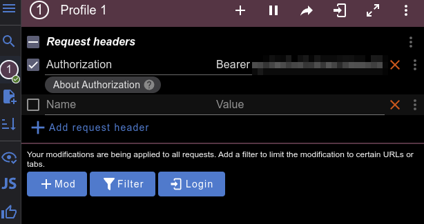

# Social Media API 📚📚📚

API for library management with borrowings and status updates via Telegram.

API allows to manage book database, make borrowings with validation and updates admins on borrowing statuses via Telegram (borrowed/returned).

## Technologies

- Django Rest Framework
- Telegram bot API
- Postgres
- Docker

## Telegram bot
Please refer to Telegram documentation/tutorial (e.g. https://core.telegram.org/bots/tutorial) to create Telegram bot and obtain Telegram Bot Token.
## How to run

Docker 🐳 should be installed first.

Copy .env-sample -> .env and populate with all required data.

```bash
docker-compose up --build
```

Note: superuser is created automatically with .env info if no users exist in database.
Note: if you receive telegram error for chat id, refer to logs, Telegram may change chat id if every user is superuser in chat.
## Accessing API 🔓

Creating user:  
/api/user/register/

Getting access token:  
/api/user/token/


## Features ⭐

- JWT authentication.
- Admin panel via /admin/
- Documentation via /api/doc/swagger/
- CRUD for books.
- CRUD for borrowings.
- Manage borrowings.
- Retrieve borrowings by active status and user.
- Telegram notification system on borrowings changes.
- API test included.
- Auto superuser creation on first launch.

## Note on JWT authentication 🪙

To access API with JWT token please install ModHeader extension:  
[ModHeader for Chrome](https://chromewebstore.google.com/detail/modheader-modify-http-hea/idgpnmonknjnojddfkpgkljpfnnfcklj)  
[ModHeader for Firefox](https://addons.mozilla.org/uk/firefox/addon/modheader-firefox/)

Click on extension, paste your JWT auth token with prefix word "bearer", e.g. on picture below.  
  
Select Authorization request header and check the box.
You can now access other parts of API.
